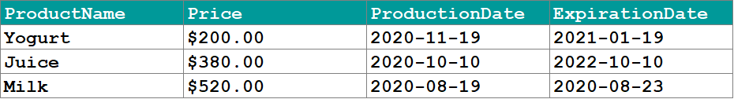

<p>
    GitHub: <a href="https://github.com/dark-teal-coder">@dark-teal-coder</a>
    <br />
    First Published Date: 2022-05-17
    <br />
    Last Modified Date: 2022-08-18
</p>

&nbsp;

---

&nbsp;

# SQL

This course covers an array of SQL-related topics, such as retrieving, updating and filtering data; functions and subqueries; creating & updating tables; & many more!

&nbsp;

---

&nbsp;

## Basic Concepts

&nbsp;

### 1.1 Lesson: Introduction to Databases

#### Welcome to SQL

A **database** is a collection of data that is organized in a manner that facilitates ease of access, as well as efficient management and updating.

A database is made up of tables that store relevant information.

For example, you would use a database, if you were to create a website like YouTube, which contains a lot of information like videos, usernames, passwords, comments.

<p align="center">
    
</p>

> :warning: In this course we will learn how to create and query databases using SQL!

#### Database Tables

A **table** stores and displays data in a structured format consisting of columns and rows that are similar to those seen in Excel spreadsheets.

Databases often contain multiple tables, each designed for a specific purpose. For example, imagine creating a database table of names and telephone numbers.

First, we would set up columns with the titles *FirstName*, *LastName* and *TelephoneNumber*.

Each table includes its own set of fields, based on the data it will store.

<p align="center">
    
</p>

> :warning: A table has a specified number of columns but can have any number of rows.

#### Primary Keys

A primary key is a field in the table that uniquely identifies the table records.

The primary key's main features:

- It must contain a **unique value** for each row.
- It cannot contain **NULL** values.

For example, our table contains a record for each name in a phone book. The unique **ID** number would be a good choice for a primary key in the table, as there is always the chance for more than one person to have the same name.

<p align="center">
    
</p>

> :warning:
>
> - Tables are limited to ONE primary key each.
> - The primary key's value must be different for each row.

#### What is SQL?

Once you understand what a database is, understanding SQL is easy. **SQL** stands for **S**tructured **Q**uery **L**anguage.

**SQL** is used to access and manipulate a **database**.
**MySQL** is a **program** that understands **SQL**.

SQL can:

- insert, update, or delete records in a database.
- create new databases, tables, stored procedures and views.
- retrieve data from a database, etc.

> :warning:
>
> SQL is an ANSI (American National Standards Institute) standard, but there are different versions of the SQL language.
>
> Most SQL database programs have their own proprietary extensions in addition to the SQL standard, but all of them support the major commands.

&nbsp;

### 2.1 Lesson: SQL Statements: SELECT

#### Basic SQL Commands 1

The SQL ```SHOW``` statement displays information contained in the database and its tables. This helpful tool lets you keep track of your database contents and remind yourself about the structure of your tables.

For example, the ```SHOW DATABASES``` command lists the databases managed by the server.

```sql
SHOW DATABASES
```

Throughout the tutorial we will be using the MySQL engine and the PHPMyAdmin tool to run SQL queries.

> :warning: The easiest way to get MySQL and PHPMyAdmin is to install free tools like XAMPP or WAMP, which include all necessary installers.

#### Basic SQL Commands 2

The ```SHOW TABLES``` command is used to display all of the tables in the currently selected MySQL database.

<p align="center">
    
</p>

> :warning: For our example, we have created a database, my_database, with a table called customers.

#### Basic SQL Commands 3

```SHOW COLUMNS``` displays information about the columns in a given table.

The following example displays the columns in our customers table:

```sql
SHOW COLUMNS FROM customers
```

Result:

<p align="center">
    
</p>

SHOW COLUMNS displays the following values for each table column:

- **Field**: column name
- **Type**: column data type
- **Key**: indicates whether the column is indexed
- **Default**: default value assigned to the column
- **Extra**: may contain any additional information that is available about a given column

> :warning: The columns for the customers table have also been created using the PHPMyAdmin tool.

#### SELECT Statement

The ```SELECT``` statement is used to select data from a database.

The result is stored in a result table, which is called the **result-set**.

A **query** may retrieve information from selected columns or from all columns in the table.

To create a simple SELECT statement, specify the name(s) of the column(s) you need from the table.

**Syntax of the SQL SELECT Statement**:

```sql
SELECT column_list
FROM table_name
```

- **column_list** includes one or more columns from which data is retrieved
- **table-name** is the name of the table from which the information is retrieved

**Below is the data from our customers table:**

<p align="center">
    
</p>

The following SQL statement selects the FirstName from the customers table:

```sql
SELECT FirstName FROM customers
```

Result:

<p align="center">
    
</p>

> :warning: A SELECT statement retrieves zero or more rows from one or more database tables.

&nbsp;

### 3.1 Lesson: SQL Syntax Rules

#### Multiple Queries

SQL allows to run multiple queries or commands at the same time.

The following SQL statement selects the FirstName and City columns from the customers table:

```sql
SELECT FirstName FROM customers;
SELECT City FROM customers;
```

Result:

<p align="center">
    
</p>

<p align="center">
    
</p>

> :warning:
>
> Remember to end each SQL statement with a semicolon to indicate that the statement is complete and ready to be interpreted.
>
> In this tutorial, we will use semicolon at the end of each SQL statement.

#### Case Sensitivity

SQL is case **insensitive**.

The following statements are equivalent and will produce the same result:

```sql
select City from customers;
SELECT City FROM customers;
sElEct City From customers;
```

> :warning: It is common practice to write all SQL commands in **upper-case**.

#### Syntax Rules

A single SQL statement can be placed on one or more text lines. In addition, multiple SQL statements can be combined on a single text line.

White spaces and multiple lines are ignored in SQL.

For example, the following query is absolutely correct.

```sql
SELECT        City

FROM customers;
```

However, it is recommended to avoid unnecessary white spaces and lines.

> :warning: Combined with proper spacing and indenting, breaking up the commands into logical lines will make your SQL statements much easier to read and maintain.

&nbsp;

### 4.1 Lesson: Selecting Multiple Columns

#### Selecting Multiple Columns

As previously mentioned, the SQL SELECT statement retrieves records from tables in your SQL database.

You can select multiple table columns at once.

Just list the column names, separated by **commas**

```sql
SELECT FirstName, LastName, City
FROM customers;
```

Result:

<p align="center">
    
</p>

> :warning: Do not put a comma after the last column name.

#### Selecting All Columns

To retrieve all of the information contained in your table, place an **asterisk (\*)** sign after the SELECT command, rather than typing in each column names separately.

The following SQL statement selects all of the columns in the customers table:

```sql
SELECT * FROM customers;
```

Result:

<p align="center">
    
</p>

> :warning: In SQL, the asterisk means all.

&nbsp;

### 4.2 Practice: Best Before

#### Selecting Multiple Columns

When buying food, it is important to make sure it is fresh and not expired.

You are given the following 'Products' list:

<p align="center">
    
</p>

Write a query to select the ProductName, ProductionDate and ExpirationDate.

> :warning: Use the SELECT statement and separate the required columns by commas.

#### Solution

> 🔑 See [solution and explanation](./practice-solution-4.2.sql).

&nbsp;

### 5.1 Lesson: DISTINCT and LIMIT

#### The DISTINCT Keyword

In situations in which you have multiple duplicate records in a table, it might make more sense to return only unique records, instead of fetching the duplicates.

The SQL ```DISTINCT``` keyword is used in conjunction with SELECT to eliminate all duplicate records and return only unique ones.

The basic syntax of DISTINCT is as follows:

```sql
SELECT DISTINCT column_name1, column_name2
FROM table_name;
```

See the customers table below:

<p align="center">
    
</p>

Note that there are duplicate City names. The following SQL statement selects only distinct values from the City column:

```sql
SELECT DISTINCT City FROM customers;
```

This would produce the following result. Duplicate entries have been removed.

<p align="center">
    
</p>

> :warning: The DISTINCT keyword only fetches the unique values.

#### The LIMIT Keyword 1

By default, all results that satisfy the conditions specified in the SQL statement are returned. However, sometimes we need to retrieve just a subset of records. In MySQL, this is accomplished by using the LIMIT keyword.

The syntax for LIMIT is as follows:

```sql
SELECT column_list
FROM table_name
LIMIT [number of records];
```

For example, we can retrieve the first five records from the customers table.

```sql
SELECT ID, FirstName, LastName, City
FROM customers LIMIT 5;
```

This would produce the following result:

<p align="center">
    
</p>

> :warning: By default, all results that satisfy the conditions specified in the SQL statement are returned.

#### The LIMIT Keyword 2

You can also pick up a set of records from a particular offset.

In the following example, we pick up four records, starting from the third position:

```sql
SELECT ID, FirstName, LastName, City
FROM customers OFFSET 3 LIMIT 4;
```

This would produce the following result:

<p align="center">
    
</p>

> :warning: The reason that it produces results starting from ID number four, and not three, is that MySQL starts counting from zero, meaning that the offset of the first row is 0, not 1.

&nbsp;

### 5.2 Practice: Customer Copies

#### The DISTINCT Keyword

At the conclusion of a bank transaction, 6 checks are printed -- 3 originals for the bank, and 3 copies for the customer.

Here is the list of all the checks named Operation

<p align="center">
    
</p>

Write a query to show only the unique checks that are given to the customer.

> :warning: Use the DISTINCT statement to return the unique values of mentioned column.

#### Solution

> 🔑 See [solution and explanation](./practice-solution-5.2.sql).

&nbsp;

### 5.3 Practice: The Lucky Four

#### The LIMIT Keyword

8 people are registered for an online course, but only the first 4 of them are able to participate.

Here is the Participants table:

<p align="center">
    
</p>

Select the first four participants from the given list.

> :warning: The LIMIT keyword can help you.

#### Solution

> 🔑 See [solution and explanation](./practice-solution-5.3.sql).

&nbsp;

### 6.1 Lesson: Sorting Results

#### Fully Qualified Names

In SQL, you can provide the table name prior to the column name, by separating them with a **dot**.

The following statements are equivalent:

```sql
SELECT City FROM customers;
SELECT customers.City FROM customers;
```

The term for the above-mentioned syntax is called the "fully qualified name" of that column.

> :warning: This form of writing is especially useful when working with multiple tables that may share the same column names.

#### Order By

```ORDER BY``` is used with ```SELECT``` to **sort** the returned data.

The following example sorts our customers table by the FirstName column.

```sql
SELECT * FROM customers
ORDER BY FirstName;
```

Result:

<p align="center">
    
</p>

As you can see, the rows are ordered alphabetically by the FirstName column.

> :warning: By default, the ORDER BY keyword sorts the results in ascending order.

#### Sorting Multiple Columns

ORDER BY can sort retrieved data by multiple columns. When using ORDER BY with more than one column, separate the list of columns to follow ORDER BY with commas.

Here is the customers table, showing the following records:

<p align="center">
    
</p>

To order by LastName and Age:

```sql
SELECT * FROM customers
ORDER BY LastName, Age;
```

This ORDER BY statement returns the following result:

<p align="center">
    
</p>

As we have two Smiths, they will be ordered by the Age column in ascending order.

> :warning: The ORDER BY command starts ordering in the same sequence as the columns. It will order by the first column listed, then by the second, and so on.

&nbsp;

### 6.2 Practice: Leaderboarding

#### Sorting Results

Six players have competed in a chess tournament and their scores have been tallied.

Here is the table of Players:

<p align="center">
    
</p>

Sort the players by losses to derive the leaderboard.

> :warning: Recall the ORDER BY keyword.

#### Solution

> 🔑 See [solution and explanation](./practice-solution-6.2.sql).

&nbsp;

### 7.1 Lesson: Module 1 Quiz

Question 01: A database consists of:

- [ ] Tables
- [ ] Rows
- [ ] Columns

Question 02: Drag and drop from the options below to list the table names.

```sql
_____ TABLES;
```

- [ ] ```SHOW```
- [ ] ```LIMIT```
- [ ] ```VIEW```
- [ ] ```SELECT```

Question 03: Why use primary keys?

- [ ] It's an SQL standard
- [ ] To guarantee the uniqueness of a row
- [ ] Just for fun

Question 04: Drag and drop from the options below to select distinct names from the ''students'' table, ordered by name.

```sql
SELECT _____ name
_____ students
_____ name;
```

- [ ] ```BY```
- [ ] ```LIMIT```
- [ ] ```FROM```
- [ ] ```DISTINCT```
- [ ] ```IN```
- [ ] ```ORDER BY```

&nbsp;

### 8 Code Project: Cakes

#### Cakes

A local bakery creates unique cake sets. Each cake set contains three different cakes.

Here is the cakes table:

<p align="center">
    
</p>

Тoday a customer want a cake set that has minimal calories.

Write a query to sort the cakes by calorie count and select the first 3 cakes from the list to offer the customer.

> :warning: Try to combine ORDER BY and LIMIT keywords.

#### Solution

```sql
SELECT * FROM cakes ORDER BY calories LIMIT 3
```

> 🔑

&nbsp;

---

&nbsp;

## Filtering, Functions, Subqueries

&nbsp;

### 9.1 Lesson: The WHERE Statement

#### The WHERE Statement

The WHERE clause is used to extract only those records that fulfill a specified criterion.

The syntax for the WHERE clause:

```sql
SELECT column_list
FROM table_name
WHERE condition;
```

Consider the following table:

<p align="center">
    
</p>

In the above table, to SELECT a specific record:

```sql
SELECT * FROM customers
WHERE ID = 7;
```

Result:

<p align="center">
    
</p>

> :warning: The WHERE clause is used to extract only those records that fulfill a specified criterion.

#### SQL Operators

Comparison Operators and Logical Operators are used in the WHERE clause to filter the data to be selected.

The following comparison operators can be used in the WHERE clause:

<p align="center">
    
</p>

For example, we can display all customers names listed in our table, with the exception of the one with ID 5.

```sql
SELECT * FROM customers
WHERE ID != 5;
```

Result:

<p align="center">
    
</p>

> :warning: As you can see, the record with ID=5 is excluded from the list.

#### The BETWEEN Operator

The BETWEEN operator selects values within a range. The first value must be lower bound and the second value, the upper bound.

The syntax for the BETWEEN clause is as follows:

```sql
SELECT column_name(s)
FROM table_name
WHERE column_name BETWEEN value1 AND value2;
```

The following SQL statement selects all records with IDs that fall between 3 and 7:

```sql
SELECT * FROM customers
WHERE ID BETWEEN 3 AND 7;
```

Result:

<p align="center">
    
</p>

> :warning: As you can see, the lower bound and upper bound are both included in the range.

#### Text Values

When working with text columns, surround any text that appears in the statement with single quotation marks (').

The following SQL statement selects all records in which the City is equal to 'New York'.

```sql
SELECT ID, FirstName, LastName, City
FROM customers
WHERE City = 'New York';
```

<p align="center">
    
</p>

> :warning: If your text contains an apostrophe (single quote), you should use two single quote characters to escape the apostrophe. For example: 'Can''t'.

&nbsp;

### 9.2 Practice: Salary Range

#### The BETWEEN Operator

You are given the following table named staff:

<p align="center">
    
</p>

Write a query to output the names of employees whose salaries are between 1500 and 1900.

> :warning: Combine the WHERE statement with the BETWEEN operator!

#### Solution

> 🔑 See [solution and explanation](./practice-solution-9.2.sql).

&nbsp;

### 10.1 Lesson: Filtering with AND, OR

#### Logical Operators

Logical operators can be used to combine two Boolean values and return a result of true, false, or null.

The following operators can be used:

<p align="center">
    
</p>

When retrieving data using a SELECT statement, use logical operators in the WHERE clause to combine multiple conditions.

If you want to select rows that satisfy all of the given conditions, use the logical operator, AND.

<p align="center">
    
</p>

To find the names of the customers between 30 to 40 years of age, set up the query as seen here:

```sql
SELECT ID, FirstName, LastName, Age
FROM customers
WHERE Age >= 30 AND Age <= 40;
```

This results in the following output:

<p align="center">
    
</p>

> :warning: You can combine as many conditions as needed to return the desired results.

#### OR

If you want to select rows that satisfy at least one of the given conditions, you can use the logical OR operator.

The following table describes how the logical OR operator functions:

<p align="center">
    
</p>

For example, if you want to find the customers who live either in New York or Chicago, the query would look like this:

```sql
SELECT * FROM customers
WHERE City = 'New York' OR City = 'Chicago';
```

Result:

<p align="center">
    
</p>

> :warning: You can OR two or more conditions.

#### Combining AND & OR

The SQL AND and OR conditions may be combined to test multiple conditions in a query.

These two operators are called conjunctive operators.

When combining these conditions, it is important to use parentheses, so that the order to evaluate each condition is known.

Consider the following table:

<p align="center">
    
</p>

The statement below selects all customers from the city "New York" AND with the age equal to "30" OR “35":

```sql
SELECT * FROM customers
WHERE City = 'New York'
AND (Age=30 OR Age=35);
```

Result:

<p align="center">
    
</p>

> :warning: You can nest as many conditions as you need.

&nbsp;

### 10.2 Practice: Superheros

#### Logical Operators

You are given the following films table with details about superhero movies:

<p align="center">
    
</p>

Write a query to output the names of all of the films which were produced by Marvel Studios in 2010 or later, sorted by the 'name' column.

> :warning: Use the AND operator to combine two or more conditions.

#### Solution

> 🔑 See [solution and explanation](./practice-solution-10.2.sql).

&nbsp;

### 11.1 Lesson: IN, NOT IN Statements

#### The IN Operator 1

The IN operator is used when you want to compare a column with more than one value.

For example, you might need to select all customers from New York, Los Angeles, and Chicago.

With the OR condition, your SQL would look like this:

```sql
SELECT * FROM customers
WHERE City = 'New York'
OR City = 'Los Angeles'
OR City = 'Chicago';
```

Result:

<p align="center">
    
</p>

> :warning: The IN operator is used when you want to compare a column with more than one value.

#### The IN Operator 2

You can achieve the same result with a single IN condition, instead of the multiple OR conditions:

```sql
SELECT * FROM customers
WHERE City IN ('New York', 'Los Angeles', 'Chicago');
```

This would also produce the same result:

<p align="center">
    
</p>

> :warning: Note the use of parentheses in the syntax.

#### The NOT IN Operator

The NOT IN operator allows you to exclude a list of specific values from the result set.

If we add the NOT keyword before IN in our previous query, customers living in those cities will be excluded:

```sql
SELECT * FROM customers
WHERE City NOT IN ('New York', 'Los Angeles', 'Chicago');
```

Result:

<p align="center">
    
</p>

> :warning: The NOT IN operator allows you to exclude a list of specific values from the result set.

&nbsp;

### 11.2 Practice: Get The Ball Rolling!

#### The IN Operator

You are sorting football teams by leagues and given the following table named teams.

<p align="center">
    
</p>

Write a query to output the team names and the countries of all teams that have played in La Liga (Spain), Premier League (England) and Bundesliga (Germany)․

> :warning: Use the IN operator.

#### Solution

> 🔑 See [solution and explanation](./practice-solution-11.2.sql).

&nbsp;

### 12.1 Lesson: Custom Columns

#### The CONCAT Function

The CONCAT function is used to concatenate two or more text values and returns the concatenating string.

Let's concatenate the FirstName with the City, separating them with a comma:

```sql
SELECT CONCAT(FirstName, ', ' , City) FROM customers;
```

Result:

<p align="center">
    
</p>

> :warning: The CONCAT() function takes two or more parameters.

#### The AS Keyword

A concatenation results in a new column. The default column name will be the CONCAT function.

You can assign a custom name to the resulting column using the AS keyword:

```sql
SELECT CONCAT(FirstName,', ', City) AS new_column
FROM customers;
```

And when you run the query, the column name appears to be changed.

<p align="center">
    
</p>

> :warning: A concatenation results in a new column.

#### Arithmetic Operators

Arithmetic operators perform arithmetical operations on numeric operands. The Arithmetic operators include addition (+), subtraction (-), multiplication (*) and division (/).

The following employees table shows employee names and salaries:

<p align="center">
    
</p>

The example below adds 500 to each employee's salary and selects the result:

```sql
SELECT ID, FirstName, LastName, Salary+500 AS Salary
FROM employees;
```

Result:

<p align="center">
    
</p>

> :warning: Parentheses can be used to force an operation to take priority over any other operators. They are also used to improve code readability.

&nbsp;

### 12.2 Practice: Annual Bonuses

#### The AS Keyword

You are given the following staff table:

<p align="center">
    
</p>

The salary shown in the table is monthly.
Each employee receives a bonus once a year. The bonus for each employee is equal to their years of experience multiplied by 500.

Write a query to output the firstname and lastname columns into one column named fullname separated by space, and the total annual salary for each employee keeping in mind bonuses named 'total'. Sort by the 'total' column.

> :warning: Use the AS keyword and the CONCAT function!

#### Solution

> 🔑 See [solution and explanation](./practice-solution-12.2.sql).

&nbsp;

### 13.1 Lesson: Functions

#### The UPPER Function

The UPPER function converts all letters in the specified string to uppercase.

The LOWER function converts the string to lowercase.

The following SQL query selects all LastNames as uppercase:

```sql
SELECT FirstName, UPPER(LastName) AS LastName
FROM employees;
```

Result:

<p align="center">
    
</p>

> :warning: If there are characters in the string that are not letters, this function will have no effect on them.

#### SQRT and AVG

The SQRT function returns the square root of given value in the argument.

Let's calculate the square root of each Salary:

```sql
SELECT Salary, SQRT(Salary)
FROM employees;
```

Result:

<p align="center">
    
</p>

Similarly, the AVG function returns the average value of a numeric column:

```sql
SELECT AVG(Salary) FROM employees;
```

Result:

<p align="center">
    
</p>

> :warning: Another way to do the SQRT is to use POWER with the 1/2 exponent. However, SQRT seems to work faster than POWER in this case.

#### The SUM function

The SUM function is used to calculate the sum for a column's values.

For example, to get the sum of all of the salaries in the employees table, our SQL query would look like this:

```sql
SELECT SUM(Salary) FROM employees;
```

Result:

<p align="center">
    
</p>

> :warning: The sum of all of the employees' salaries is 31000.

&nbsp;

### 13.2 Practice: Average Grades

#### AVG

You are given the following table sam_grades, which shows Sam's exam scores.

<p align="center">
    
</p>

Write a query to output the average of Sam's exam scores for the first semester.

> :warning: Use the AVG() function!

#### Solution

> 🔑 See [solution and explanation](./practice-solution-13.2.sql).

&nbsp;

### 14.1 Lesson: Subqueries

#### Subqueries 1

A subquery is a query within another query.

Let's consider an example. We might need the list of all employees whose salaries are greater than the average.

First, calculate the average:

```sql
SELECT AVG(Salary) FROM employees;
```

As we already know the average, we can use a simple WHERE to list the salaries that are greater than that number.

```sql
SELECT FirstName, Salary FROM employees
WHERE  Salary > 3100
ORDER BY Salary DESC;
```

Result:

<p align="center">
    
</p>

> :warning: The DESC keyword sorts results in descending order. Similarly, ASC sorts the results in ascending order.

#### Subqueries 2

A single subquery will return the same result more easily.

```sql
SELECT FirstName, Salary FROM employees
WHERE  Salary > (SELECT AVG(Salary) FROM employees)
ORDER BY Salary DESC;
```

The same result will be produced.

<p align="center">
    
</p>

> :warning: Enclose the subquery in parentheses. Also, note that there is no semicolon at the end of the subquery, as it is part of our single query.

&nbsp;

### 14.2 Practice: Let's Get Fit!

#### Subqueries

Monica has just returned from nutritionist and was advised to only eat low-fat foods.
Here is the Foods table:

<p align="center">
    
</p>

Help Monica lose weight by writing a query to choose the foods, whose fat percentages are lower than the average from the "Foods" table. Then show the resulting table.

> :warning: Use the AVG() function.

#### Solution

> 🔑 See [solution and explanation](./practice-solution-14.2.sql).

&nbsp;

### 15.1 Lesson: LIKE and MIN

#### The Like Operator

The LIKE keyword is useful when specifying a search condition within your WHERE clause.

```sql
SELECT column_name(s)
FROM table_name
WHERE column_name LIKE pattern;
```

SQL pattern matching enables you to use `_` to match any single character and "%" to match an arbitrary number of characters (including zero characters).

For example, to select employees whose FirstNames begin with the letter A, you would use the following query:

```sql
SELECT * FROM employees
WHERE FirstName LIKE 'A%';
```

Result:

<p align="center">
    
</p>

As another example, the following SQL query selects all employees with a LastName ending with the letter "s":

```sql
SELECT * FROM employees
WHERE LastName LIKE '%s';
```

Result:

<p align="center">
    
</p>

> :warning: The % wildcard can be used multiple times within the same pattern.

#### The MIN Function

The MIN function is used to return the minimum value of an expression in a SELECT statement.

For example, you might wish to know the minimum salary among the employees.

```sql
SELECT MIN(Salary) AS Salary FROM employees;
```

Result:

<p align="center">
    
</p>

> :warning: All of the SQL functions can be combined together to create a single expression.

&nbsp;

### 15.2 Practice: Chocolate!

#### LIKE

You are having dinner at a restaurant and decide to order a chocolate dessert.

Here is the desserts menu:

<p align="center">
    
</p>

Write a query to output only chocolate desserts.

> :warning: Use the LIKE operator, and don't forget about "%".

#### Solution

> 🔑 See [solution and explanation](./practice-solution-15.2.sql).

&nbsp;

### 16.1 Lesson: Module 2 Quiz

Question 01: Fill in the blanks to select all values from the "students" table in which the field "university" equals "MIT".

```sql
SELECT * FROM _____
WHERE _____ = 'MIT';
```

Question 02: Rearrange the code to select students from MIT and Stanford, and order the results by the "university" column.

- [ ] ```FROM students WHERE university```
- [ ] ```SELECT name, university```
- [ ] ```ORDER BY university;```
- [ ] ```IN('Stanford', 'MIT')```

Question 03: Which keyword is the correct one for custom columns?

- [ ] ```SIMILAR```
- [ ] ```LIKE```
- [ ] ```AS```

Question 04: What is the name of the aggregate function for calculating the sum?

- [ ] ```AGGR```
- [ ] ```SUM```
- [ ] ```SQRT```
- [ ] ```AVG```

Question 05: Drag and drop from the options below to select name and age from ''students'', where age is greater than the average of all ages. Use a subquery to calculate the average value of age.

```sql
_____ name, age
FROM students
_____ age >
(SELECT _____(age)
FROM students)
```

- [ ] ```SELECT```
- [ ] ```ORDER BY```
- [ ] ```WHERE```
- [ ] ```VALUE```
- [ ] ```AVG```

&nbsp;

### 17 Code Project: Apartments

#### Apartments

You want to rent an apartment and have the following table named Apartments:

<p align="center">
    
</p>

Write a query to output the apartments whose prices are greater than the average and are also not rented, sorted by the 'Price' column.

> :warning: Recall the AVG keyword.

#### Solution

> 🔑

&nbsp;

---

&nbsp;

## JOIN, Table Operations

&nbsp;

### 18.1 Lesson: Joining Tables

#### Joining Tables 1

All of the queries shown up until now have selected from just one table at a time.

One of the most beneficial features of SQL is the ability to combine data from two or more tables.

In the two tables that follow, the table named customers stores information about customers:

<p align="center">
    
</p>

The orders table stores information about individual orders with their corresponding amount:

<p align="center">
    
</p>

> :warning: In SQL, "joining tables" means combining data from two or more tables. A table join creates a temporary table showing the data from the joined tables.

#### Joining Tables 2

Rather than storing the customer name in both tables, the orders table contains a reference to the customer ID that appears in the customers table. This approach is more efficient, as opposed to storing the same text values in both tables.

In order to be able to select the corresponding data from both tables, we will need to join them on that condition.

> :warning: Tap continue to see how!

#### Joining Tables 3

To join the two tables, specify them as a comma-separated list in the FROM clause:

```sql
SELECT customers.ID, customers.Name, orders.Name, orders.Amount
FROM customers, orders
WHERE customers.ID=orders.Customer_ID
ORDER BY customers.ID;
```

> :warning: Each table contains "ID" and "Name" columns, so in order to select the correct ID and Name, fully qualified names are used.

Note that the WHERE clause "joins" the tables on the condition that the ID from the customers table should be equal to the customer_ID of the orders table.

Result:

<p align="center">
    
</p>

The returned data shows customer orders and their corresponding amount.

> :warning: Specify multiple table names in the FROM by comma-separating them.

&nbsp;

### 18.2 Practice: Mentor And Apprentice

#### Solution

> 🔑

&nbsp;

### 19.1 Lesson: Types of Join

#### Custom Names

Custom names can be used for tables as well. You can shorten the join statements by giving the tables "nicknames":

```sql
SELECT ct.ID, ct.Name, ord.Name, ord.Amount
FROM customers AS ct, orders AS ord
WHERE ct.ID=ord.Customer_ID
ORDER BY ct.ID;
```

> :warning: As you can see, we shortened the table names as we used them in our query.

#### Types of Join

The following are the types of JOIN that can be used in MySQL:

- INNER JOIN
- LEFT JOIN
- RIGHT JOIN

INNER JOIN is equivalent to JOIN. It returns rows when there is a match between the tables.

Syntax:

```sql
SELECT column_name(s)
FROM table1 INNER JOIN table2
ON table1.column_name=table2.column_name;
```

> :warning: Note the ON keyword for specifying the inner join condition.

The image below demonstrates how INNER JOIN works:

<p align="center">
    
</p>

> :warning: Only the records matching the join condition are returned.

#### LEFT JOIN

The LEFT JOIN returns all rows from the left table, even if there are no matches in the right table.

This means that if there are no matches for the ON clause in the table on the right, the join will still return the rows from the first table in the result.

The basic syntax of LEFT JOIN is as follows:

```sql
SELECT table1.column1, table2.column2...
FROM table1 LEFT OUTER JOIN table2
ON table1.column_name = table2.column_name;
```

> :warning: The OUTER keyword is optional, and can be omitted.

The image below demonstrates how LEFT JOIN works:

<p align="center">
    
</p>

Consider the following tables.

customers:

<p align="center">
    
</p>

items:

<p align="center">
    
</p>

The following SQL statement will return all customers, and the items they might have:

```sql
SELECT customers.Name, items.Name
FROM customers LEFT OUTER JOIN items
ON customers.ID=items.Seller_id;
```

Result:

<p align="center">
    
</p>

The result set contains all the rows from the left table and matching data from the right table.

> :warning: If no match is found for a particular row, NULL is returned.

#### RIGHT JOIN

The RIGHT JOIN returns all rows from the right table, even if there are no matches in the left table.

<p align="center">
    
</p>

The basic syntax of RIGHT JOIN is as follows:

```sql
SELECT table1.column1, table2.column2...
FROM table1 RIGHT OUTER JOIN table2
ON table1.column_name = table2.column_name;
```

> :warning: Again, the OUTER keyword is optional, and can be omitted.

Consider the same example from our previous lesson, but this time with a RIGHT JOIN:

```sql
SELECT customers.Name, items.Name FROM customers
RIGHT JOIN items ON customers.ID=items.Seller_id;
```

Result:

<p align="center">
    
</p>

The RIGHT JOIN returns all the rows from the right table (items), even if there are no matches in the left table (customers).

> :warning: There are other types of joins in the SQL language, but they are not supported by MySQL.

&nbsp;

### 19.2 Practice: Sorting The Inventory

#### Solution

> 🔑

&nbsp;

### 20.1 Lesson: UNION

#### Set Operation

Occasionally, you might need to combine data from multiple tables into one comprehensive dataset. This may be for tables with similar data within the same database or maybe there is a need to combine similar data across databases or even across servers.

To accomplish this, use the UNION and UNION ALL operators.

UNION combines multiple datasets into a single dataset, and removes any existing duplicates.

UNION ALL combines multiple datasets into one dataset, but does not remove duplicate rows.

> :warning: UNION ALL is faster than UNION, as it does not perform the duplicate removal operation over the data set.

#### UNION

The UNION operator is used to combine the result-sets of two or more SELECT statements.

All SELECT statements within the UNION must have the same number of columns. The columns must also have the same data types. Also, the columns in each SELECT statement must be in the same order.

The syntax of UNION is as follows:

```sql
SELECT column_name(s) FROM table1
UNION
SELECT column_name(s) FROM table2;
```

Here is the First of two tables:

<p align="center">
    
</p>

And here is the Second:

<p align="center">
    
</p>

```sql
SELECT ID, FirstName, LastName, City FROM First
UNION
SELECT ID, FirstName, LastName, City FROM Second;
```

The resulting table will look like this one:

<p align="center">
    
</p>

> :warning: As you can see, the duplicates have been removed.

**TIP**:
If your columns don't match exactly across all queries, you can use a NULL (or any other) value such as:

```sql
SELECT FirstName, LastName, Company FROM businessContacts
UNION
SELECT FirstName, LastName, NULL FROM otherContacts;
```

> :warning: The UNION operator is used to combine the result-sets of two or more SELECT statements.

#### UNION ALL

UNION ALL selects all rows from each table and combines them into a single table.

The following SQL statement uses UNION ALL to select data from the First and Second tables:

```sql
SELECT ID, FirstName, LastName, City FROM First
UNION ALL
SELECT ID, FirstName, LastName, City FROM Second;
```

The resulting table:

<p align="center">
    
</p>

> :warning: As you can see, the result set includes the duplicate rows as well.

&nbsp;

### 20.2 Practice: Chess Tournament

#### Solution

> 🔑

&nbsp;

### 21.1 Lesson: The INSERT Statement

#### Inserting Data 1

SQL tables store data in rows, one row after another. The INSERT INTO statement is used to add new rows of data to a table in the database.

The SQL INSERT INTO syntax is as follows:

```sql
INSERT INTO table_name
VALUES (value1, value2, value3,...);
```

> :warning: Make sure the order of the values is in the same order as the columns in the table.

Consider the following Employees table:

<p align="center">
    
</p>

Use the following SQL statement to insert a new row:

```sql
INSERT INTO Employees
VALUES (8, 'Anthony', 'Young', 35);
SELECT * from Employees;
```

The values are comma-separated and their order corresponds to the columns in the table.

Result:

<p align="center">
    
</p>

> :warning: When inserting records into a table using the SQL INSERT statement, you must provide a value for every column that does not have a default value, or does not support NULL.

#### Inserting Data 2

Alternatively, you can specify the table's column names in the INSERT INTO statement:

```sql
INSERT INTO table_name (column1, column2, column3, ...,columnN)
VALUES (value1, value2, value3,...valueN);
```

column1, column2, ..., columnN are the names of the columns that you want to insert data into.

```sql
INSERT INTO Employees (ID, FirstName, LastName, Age)
VALUES (8, 'Anthony', 'Young', 35);
SELECT * FROM Employees;
```

This will insert the data into the corresponding columns:

<p align="center">
    
</p>

> :warning: You can specify your own column order, as long as the values are specified in the same order as the columns.

#### Inserting Data 3

It is also possible to insert data into specific columns only.

```sql
INSERT INTO Employees (ID, FirstName, LastName)
VALUES (9, 'Samuel', 'Clark');
SELECT * from Employees;
```

Result:

<p align="center">
    
</p>

> :warning: The Age column for that row automatically became 0, as that is its default value.

&nbsp;

### 21.2 Practice: More Cars!

#### Solution

> 🔑

&nbsp;

### 22.1 Lesson: UPDATE and DELETE Statements

#### Updating Data 1

The UPDATE statement allows us to alter data in the table.

The basic syntax of an UPDATE query with a WHERE clause is as follows:

```sql
UPDATE table_name
SET column1=value1, column2=value2, ...
WHERE condition;
```

You specify the column and its new value in a comma-separated list after the SET keyword.

> :warning: If you omit the WHERE clause, all records in the table will be updated!

#### Updating Data 2

Consider the following table called "Employees":

<p align="center">
    
</p>

To update John's salary, we can use the following query:

```sql
UPDATE Employees
SET Salary=5000
WHERE ID=1;
SELECT * from Employees;
```

Result:

<p align="center">
    
</p>

#### Updating Multiple Columns

It is also possible to UPDATE multiple columns at the same time by comma-separating them:

```sql
UPDATE Employees
SET Salary=5000, FirstName='Robert'
WHERE ID=1;
SELECT * from Employees;
```

Result:

<p align="center">
    
</p>

> :warning: You can specify the column order any way you like in the SET clause.

#### Deleting Data

The DELETE statement is used to remove data from your table. DELETE queries work much like UPDATE queries.

```sql
DELETE FROM table_name
WHERE condition;
```

For example, you can delete a specific employee from the table:

```sql
DELETE FROM Employees
WHERE ID=1;
SELECT * from Employees;
```

Result:

<p align="center">
    
</p>

> :warning: If you omit the WHERE clause, all records in the table will be deleted! The DELETE statement removes the data from the table permanently.

&nbsp;

### 22.2 Practice: Match The Requirements

#### Solution

> 🔑

&nbsp;

### 23.1 Lesson: Creating a Table

#### SQL Tables

A single database can house hundreds of tables, each playing its own unique role in the database schema.

SQL tables are comprised of table rows and columns. Table columns are responsible for storing many different types of data, including numbers, texts, dates, and even files.

The CREATE TABLE statement is used to create a new table.

> :warning: Creating a basic table involves naming the table and defining its columns and each column's data type.

#### Creating a Table 1

The basic syntax for the CREATE TABLE statement is as follows:

```sql
CREATE TABLE table_name
(
column_name1 data_type(size),
column_name2 data_type(size),
column_name3 data_type(size),
....
columnN data_type(size)
);
```

- The column_names specify the names of the columns we want to create.
- The data_type parameter specifies what type of data the column can hold. For example, use int for whole numbers.
- The size parameter specifies the maximum length of the table's column.

> :warning: Note the parentheses in the syntax.

#### Creating a Table 2

Assume that you want to create a table called "Users" that consists of four columns: UserID, LastName, FirstName, and City.

Use the following CREATE TABLE statement:

```sql
CREATE TABLE Users
(
   UserID int,
   FirstName varchar(100),
   LastName varchar(100),
   City varchar(100)
);
```

> :warning: varchar is the datatype that stores characters. You specify the number of characters in the parentheses after the type. So in the example above, our fields can hold max 100 characters long text.

#### Data Types

Data types specify the type of data for a particular column.

If a column called "LastName" is going to hold names, then that particular column should have a "varchar" (variable-length character) data type.

The most common data types:

- Numeric
  - INT - A normal-sized integer that can be signed or unsigned.
  - FLOAT(M,D) - A floating-point number that cannot be unsigned. You can optionally define the display length (M) and the number of decimals (D).
  - DOUBLE(M,D) - A double precision floating-point number that cannot be unsigned. You can optionally define the display length (M) and the number of decimals (D).
- Date and Time
  - DATE - A date in YYYY-MM-DD format.
  - DATETIME - A date and time combination in YYYY-MM-DD HH:MM:SS format.
  - TIMESTAMP - A timestamp, calculated from midnight, January 1, 1970
  - TIME - Stores the time in HH:MM:SS format.
- String Type
  - CHAR(M) - Fixed-length character string. Size is specified in parenthesis. Max 255 bytes.
  - VARCHAR(M) - Variable-length character string. Max size is specified in parenthesis.
  - BLOB - "Binary Large Objects" and are used to store large amounts of binary data, such as images or other types of files.
  - TEXT - Large amount of text data.

> :warning: Choosing the correct data type for your columns is the key to good database design.

#### Primary Key

The UserID is the best choice for our Users table's primary key.

Define it as a primary key during table creation, using the PRIMARY KEY keyword.

```sql
CREATE TABLE Users
(
   UserID int,
   FirstName varchar(100),
   LastName varchar(100),
   City varchar(100),
   PRIMARY KEY(UserID)
);
```

> :warning: Specify the column name in the parentheses of the PRIMARY KEY keyword.

#### Creating a Table

Now, when we run the query, our table will be created in the database.

<p align="center">
    
</p>

> :warning: You can now use INSERT INTO queries to insert data into the table.

&nbsp;

### 23.2 Practice: Video Game Scores

#### Solution

> 🔑

&nbsp;

### 24.1 Lesson: NOT NULL and AUTO_INCREMENT

#### SQL Constraints

SQL constraints are used to specify rules for table data.

The following are commonly used SQL constraints:

- NOT NULL - Indicates that a column cannot contain any NULL value.
- UNIQUE - Does not allow to insert a duplicate value in a column. The UNIQUE constraint maintains the uniqueness of a column in a table. More than one UNIQUE column can be used in a table.
- PRIMARY KEY - Enforces the table to accept unique data for a specific column and this constraint create a unique index for accessing the table faster.
- CHECK - Determines whether the value is valid or not from a logical expression.
- DEFAULT - While inserting data into a table, if no value is supplied to a column, then the column gets the value set as DEFAULT.

For example, the following means that the name column disallows NULL values.

```sql
name varchar(100) NOT NULL
```

> :warning: During table creation, specify column level constraint(s) after the data type of that column.

#### AUTO INCREMENT

Auto-increment allows a unique number to be generated when a new record is inserted into a table.

Often, we would like the value of the primary key field to be created automatically every time a new record is inserted.

By default, the starting value for AUTO_INCREMENT is 1, and it will increment by 1 for each new record.

Let's set the UserID field to be a primary key that automatically generates a new value:

```sql
UserID int NOT NULL AUTO_INCREMENT,
PRIMARY KEY (UserID)
```

> :warning: Auto-increment allows a unique number to be generated when a new record is inserted into a table.

#### Using Constraints

The example below demonstrates how to create a table using constraints.

```sql
CREATE TABLE Users (
id int NOT NULL AUTO_INCREMENT,
username varchar(40) NOT NULL,
password varchar(10) NOT NULL,
PRIMARY KEY(id)
);
```

The following SQL enforces that the "id", "username", and "password" columns do not accept NULL values. We also define the "id" column to be an auto-increment primary key field.

Here is the result:

<p align="center">
    
</p>

> :warning: When inserting a new record into the Users table, it's not necessary to specify a value for the id column; a unique new value will be added automatically.

&nbsp;

### 25.1 Lesson: Alter, Drop, Rename a Table

#### ALTER TABLE

The ALTER TABLE command is used to add, delete, or modify columns in an existing table.

You would also use the ALTER TABLE command to add and drop various constraints on an existing table.

Consider the following table called People:

<p align="center">
    
</p>

The following SQL code adds a new column named DateOfBirth

```sql
ALTER TABLE People ADD DateOfBirth date;
SELECT * from People;
```

Result:

<p align="center">
    
</p>

> :warning: All rows will have the default value in the newly added column, which, in this case, is NULL.

#### Dropping

The following SQL code demonstrates how to delete the column named DateOfBirth in the People table.

```sql
ALTER TABLE People
DROP COLUMN DateOfBirth;
SELECT * from People;
```

The People table will now look like this:

<p align="center">
    
</p>

> :warning: The column, along with all of its data, will be completely removed from the table.

To delete the entire table, use the DROP TABLE command:

```sql
DROP TABLE People;
```

> :warning: Be careful when dropping a table. Deleting a table will result in the complete loss of the information stored in the table!

#### Renaming

The ALTER TABLE command is also used to rename columns:

```sql
ALTER TABLE People
RENAME FirstName TO name;
SELECT * from People;
```

This query will rename the column called FirstName to name.

Result:

<p align="center">
    
</p>

Renaming Tables

You can rename the entire table using the RENAME command:

```sql
RENAME TABLE People TO Users;
```

> :warning: This will rename the table People to Users.

&nbsp;

### 25.2 Practice: The Most Beautiful Locations

#### Solution

> 🔑

&nbsp;

### 26.1 Lesson: Views

#### Views

In SQL, a VIEW is a virtual table that is based on the result-set of an SQL statement.

A view contains rows and columns, just like a real table. The fields in a view are fields from one or more real tables in the database.

Views allow us to:

- Structure data in a way that users or classes of users find natural or intuitive.
- Restrict access to the data in such a way that a user can see and (sometimes) modify exactly what they need and no more.
- Summarize data from various tables and use it to generate reports.

To create a view:

```sql
CREATE VIEW view_name AS
SELECT column_name(s)
FROM table_name
WHERE condition;
```

> :warning: The SELECT query can be as complex as you need it to be. It can contain multiple JOINS and other commands.

#### Creating Views

Consider the Employees table, which contains the following records:

<p align="center">
    
</p>

Let's create a view that displays each employee's FirstName and Salary.

```sql
CREATE VIEW List AS
SELECT FirstName, Salary
FROM  Employees;
```

Now, you can query the List view as you would query an actual table.

```sql
CREATE VIEW List AS
SELECT FirstName, Salary
FROM  Employees;
SELECT * FROM List;
```

This would produce the following result:

<p align="center">
    
</p>

> :warning: A view always shows up-to-date data! The database engine uses the view's SQL statement to recreate the data each time a user queries a view.

#### Updating a View

You can update a view by using the following syntax:

```sql
CREATE OR REPLACE VIEW view_name AS
SELECT column_name(s)
FROM table_name
WHERE condition;
```

The example below updates our List view to select also the LastName:

```sql
CREATE OR REPLACE VIEW List AS
SELECT FirstName, LastName, Salary
FROM  Employees;
```

Result:

<p align="center">
    
</p>

You can delete a view with the DROP VIEW command.

```sql
DROP VIEW List;
```

> :warning: It is sometimes easier to drop a table and recreate it instead of using the ALTER TABLE statement to change the table’s definition.

&nbsp;

### 26.2 Practice: Social Media App Views

#### Solution

> 🔑

&nbsp;

### 27.1 Lesson: Module 3 Quiz

Question 01: Rearrange to select all student names and university names (use left join to show all student names).

- [ ] ```FROM students```
- [ ] ```SELECT students.names, university.names```
- [ ] ```ON students.university id=universities.id```
- [ ] ```LEFT OUTER JOIN universities```

Question 02: Drag and drop from the options below to insert a data item into the "people" table.

```sql
_____ _____ people
_____ ('John Smith', '1', 22);
```

- [ ] ```VALUES```
- [ ] ```ON```
- [ ] ```INSERT```
- [ ] ```BY```
- [ ] ```INTO```
- [ ] ```TABLE```

Question 03: Drag and drop from the options below to update the "people" table.

```sql
_____ people
_____ name='Jordan'
WHERE id=147;
```

- [ ] ```UPDATE```
- [ ] ```CREATE```
- [ ] ```INSERT```
- [ ] ```SET```
- [ ] ```INTO```

Question 04: Fill in the blanks to create a table with two columns: "id" as a primary key integer, and "name" of type varchar.

```sql
CREATE TABLE(
 id _____,
 name _____(30),
 PRIMARY KEY (_____)
);
```

- [ ] ```int```
- [ ] ```id```
- [ ] ```varchar```

Question 05: Rearrange to remove the column "age" from the "people" table.

- [ ] ```age```
- [ ] ```people```
- [ ] ```DROP COLUMN```
- [ ] ```ALTER TABLE```

Question 06: Which choice is the correct command for changing the name of a table?

- [ ] ```MODIFY```
- [ ] ```RENAME```
- [ ] ```SELECT```
- [ ] ```CHANGE NAME```

Question 07: Drag and drop from the options below to create a view named ''most_abs'' for the students with the greatest number of absences.

```sql
_____ _____ most_abs _____
SELECT id, name, absences
FROM students
ORDER BY absences DESC
LIMIT 10;
```

- [ ] ```TABLE```
- [ ] ```CREATE```
- [ ] ```AS```
- [ ] ```INTO```
- [ ] ```VIEW```
- [ ] ```SELECT```

Question 08: Drag and drop from the options below to delete the table "students" from the database.

```sql
_____ _____ _____
```

- [ ] ```DELETE```
- [ ] ```DROP```
- [ ] ```DATABASE```
- [ ] ```TABLE```
- [ ] ```ALTER```
- [ ] ```students```

Question 09: Drag and drop from the options below to remove the column "temp" from the table "students".

```sql
_____ TABLE students
_____ _____ temp
```

- [ ] ```ALTER```
- [ ] ```REPLACE```
- [ ] ```COLUMN```
- [ ] ```DROP```
- [ ] ```REMOVE```
- [ ] ```DELETE```

&nbsp;

### 28 Code Project: Zoo

#### Zoo

You manage a zoo. Each animal in the zoo comes from a different country. Here are the tables you have:

`Animals`
<p align="center">
    
</p>

`Countries`
<p align="center">
    
</p>

1) A new animal has come in, with the following details:
name - "Slim", type - "Giraffe", country_id - 1
Add him to the Animals table.
2) You want to make a complete list of the animals for the zoo’s visitors. Write a query to output a new table with each animal's name, type and country fields, sorted by countries.

> :warning: Recall INSERT and INNER JOIN keywords.

#### Solution

> 🔑

&nbsp;

---

&nbsp;

## Challenges

&nbsp;

### 29.1 Lesson: Challenge 1

Question 01: In the "users" table of website logins and passwords, select the first 10 records in the table.

```sql
SELECT * _____ users
_____ 10
```

- [ ] ```AT```
- [ ] ```FROM```
- [ ] ```RECORDS```
- [ ] ```LIMIT```

Question 02: Drag and drop from the options below to create the table "users" to store website user logins and passwords.

```sql
_____ TABLE users (
id INT NOT NULL
AUTO_INCREMENT,
login _____(100),
password VARCHAR(100))
```

- [ ] ```TABLE```
- [ ] ```CREATE```
- [ ] ```LOGIN```
- [ ] ```VARCHAR```

Question 03: Rearrange the query to select all students under age 21. The result should be sorted according to the students' names.

- [ ] ```FROM students```
- [ ] ```WHERE age < 21```
- [ ] ```SELECT *```
- [ ] ```ORDER BY name```

Question 04: Your boss asks you to print the list of the first one hundred customers who have balances greater than $1000 or who are from NY.

```sql
SELECT * FROM customers
_____ balance > 1000
_____ city = 'NY'
_____ 100
```

- [ ] ```WHERE```
- [ ] ```AND```
- [ ] ```OR```
- [ ] ```ORDER```
- [ ] ```LIMIT```

Question 05: You need the ages of all bears and lions. The first query shows the ages of bears and birds from zoo1, the other shows the ages of lions and crocodiles from zoo2.

- [ ] ```SELECT age FROM zoo1```
- [ ] ```UNION```
- [ ] ```WHERE animal IN ('bear', 'bird')```
- [ ] ```SELECT age FROM zoo2```
- [ ] ```WHERE animal IN ('lion', 'crocodile')```

Question 06: Drag and drop from the options below to create a list of customers in the form "name is from city".

```sql
SELECT
_____(name, ' is from ', _____)
FROM customers;
```

- [ ] ```AVG```
- [ ] ```city```
- [ ] ```CONCAT```
- [ ] ```form```
- [ ] ```merge```

Question 07: The zoo administration wants a list of animals whose age is greater than the average age of all of the animals.

- [ ] ```WHERE age >```
- [ ] ```FROM zoo)```
- [ ] ```(SELECT AVG(age)```
- [ ] ```SELECT * FROM zoo```

Question 08: There are many wolves in the zoo: black wolf, white wolf, lucky wolf, little wolf. They all have 'wolf' at the end of their names. Print the ages of all of the wolves.

```sql
SELECT age FROM zoo
WHERE animal LIKE '_____'
```

&nbsp;

### 30.1 Lesson: Challenge 2

Question 01: Drag and drop from the options below to retrieve all students between the ages of 18 and 22.

```sql
SELECT name _____ students
WHERE age
_____ 18 _____ 22;
```

- [ ] ```ALL```
- [ ] ```AND```
- [ ] ```FROM```
- [ ] ```OR```
- [ ] ```TO```
- [ ] ```BETWEEN```

Question 02: Drag and drop from the options below to update the "students" table to set Jake's university to MIT. His id is 682.

```sql
_____ students
SET university='_____'
WHERE _____=682
```

- [ ] ```id```
- [ ] ```Jake```
- [ ] ```MIT```
- [ ] ```name```
- [ ] ```UPDATE```

Question 03: When you inserted "elephant" as a new animal, you forgot to include the elephant's age. Correct this mistake by updating the "zoo" table.

```sql
_____ zoo
_____ age=14
WHERE animal='elephant'
```

- [ ] ```ASSIGN```
- [ ] ```MODIFY```
- [ ] ```UPDATE```
- [ ] ```SET```
- [ ] ```CHANGE```

Question 04: Drag and drop from the options below to update the food_balance to 23 for animals whose age is greater than the average age of the animals.

```sql
UPDATE zoo
SET food_balance=23
_____ age >
(SELECT _____(age)
FROM _____);
```

- [ ] ```AVG```
- [ ] ```WHERE```
- [ ] ```age```
- [ ] ```SUM```
- [ ] ```INSERT```
- [ ] ```zoo```

Question 05: You need your customer's names, along with the names of the cities in which they live. The names of the cities are stored in a separate table called "cities".

- [ ] ```FROM customers```
- [ ] ```RIGHT```
- [ ] ```ON cities.id=customers.city_id;```
- [ ] ```OUTER JOIN cities```
- [ ] ```SELECT customers.name, cities.name```

Question 06: In the university's table containing student data, the students' last names have been omitted. Correct this by adding a new column to the table.

```sql
_____ TABLE students
_____ last_name VARCHAR(100);
```

- [ ] ```CHANGE```
- [ ] ```CREATE```
- [ ] ```ADD```
- [ ] ```DELETE```
- [ ] ```ALTER```

Question 07: Drag and drop from the options below to retrieve from MIT, Stanford, and Harvard the names of all students whose first name is Jake.

```sql
SELECT name FROM students
WHERE university
_____ ('MIT', 'Stanford', 'Harvard')
_____ name='Jake';
```

- [ ] ```AND```
- [ ] ```OR```
- [ ] ```FROM```
- [ ] ```IN```
- [ ] ```BETWEEN```
